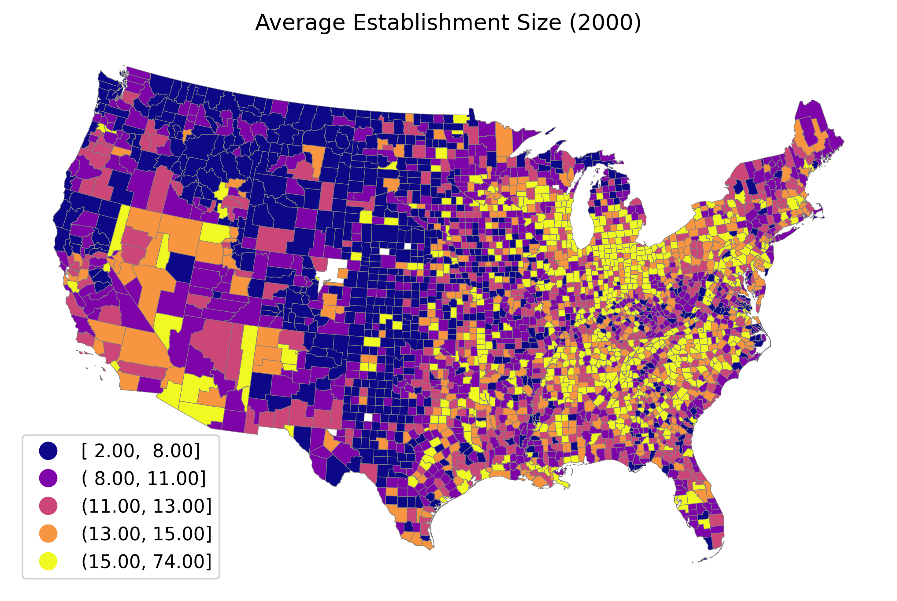
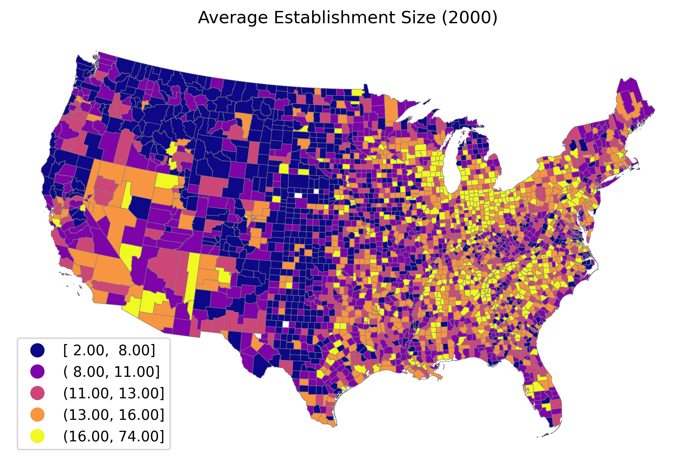

# Uniform Counties
Mapping for uniform FIPS codes (counties) from 1983 to 2009 for the contiguous United States.

## Description

The Python script for this project, *fips_crosswalk.py*, completes three tasks:

1. Retrieves data on employment and wages by county to serve as the basis for the mapping
2. Creates a visualization of which counties are observed in the data over time, which aids in creating a crosswalk, and then writes the crosswalk to a file that can be applied to data so that county definitions are consistent over time
3. Provides an example of how to apply the crosswalk to data (including how to make maps with the crosswalk)

## Retrieving data
First, the script retrieves annual files for the Quarterly Census of Employment and Wages ([QCEW](https://www.bls.gov/cew/downloadable-data-files.htm)) from the Bureau of Labor Statistics (BLS). While the BLS has a nice [API](https://www.bls.gov/cew/additional-resources/open-data/) for fetching specific data from the QCEW, it only features recent data, so this script directly downloads the annual files for 1983 to 2009.

In these files, individual counties are indexed by Federal Information Processing System ([FIPS](https://transition.fcc.gov/oet/info/maps/census/fips/fips.txt)) codes. FIPS codes are unique five-digit identifiers: the first two digits refer to the state (in alphabetical order) and the last three refer to the county within the state (also in alphabetical order, but using only odd numbers, e.g. 001 for Autauga County, AL followed by 003 for Baldwin County, AL and so on). In some states the geographical area corresponding to counties has an alternative name such as "boroughs" in Alaska and "parishes" in Louisiana. Three states have at least one "independent city" with a unqiue FIPS code that is seperate from any county (this will be relevant when making the crosswalk).

## Making crosswalk

Next, the script combines each annual file into a full panel of the raw data (*full_data.csv*) and creates a grid (FIPS-by-year) to help visualize any missing observations of FIPS codes in the data (*vis_data.csv*). Because the focus of this project is on the contiguous U.S., FIPS codes for Alaska, Hawaii, and Puerto Rico are dropped. This leaves 3,112 unique FIPS codes that are observed in the data, with 3,103 that are obsereved in every year from 1983 to 2009, and 9 FIPS codes that make the panel unbalanced:

| FIPS | County | # of Years Observed | Issue |
| :---: | :---: | :---: | :---: |
| 08014 | Broomfield County, CO | 8 | Data not available before 2002 |
| 12025 | Dade County, FL | 7 | Data unavailable after 1989 |
| 12086 | Miami-Dade County, FL | 20 | Data not available before 1990 |
| 31115 | Loup County, NE | 16 | Data unavailable for 1990 to 2000 |
| 31117 | McPherson County, NE | 16 | Data unavailable for 1990 to 2000 |
| 48033 | Borden County, TX | 16 | Data unavailable for 1990 to 2000 |
| 48301 | Loving County, TX | 16 | Data unavailable for 1990 to 2000 |
| 51560 | Clifton Forge, VA	 | 8 | Data unavailable after 1989 (except 2001) |
| 51780 | South Boston, VA | 7 | Data unavailable after 1989 |

This information on missing observations from the raw data can then be combined with the U.S. Census Bureau's (Census's) own documentation on [changes to county definitions over time](https://www.census.gov/programs-surveys/geography/technical-documentation/county-changes.html) to determine the reason behind the missing observations, which guides the determination of the best course of action in each case (the link includes changes in years before 1983, after 2009, and outside the cotiguous U.S., i.e. beyond the scope of this crosswalk, so the relevant data from this website is compiled in *census_county_changes.txt*)

A comparison of the county changes from the Census with the missing observations presented above reveals that the following three issues arise when comparing counties across time: 

1. Name changes that impact the alphabetical ordering of counties within a state and require a new FIPS code (e.g. Dade County, FL (12025) becoming (Miami-Dade Couinty, FL (12086))
2. Multiple counties being combined into a single new county / a single county being split into multiple counties (South Boston, VA (51780) being combined with Halifax County, VA (51083))
3. New counties being created from parts of exitsting counties (e.g. Broomfield County, CO (08014) from parts of Adams County, CO (08001), Boulder County, CO (08013), and Weld County, CO (08123))

However, an additional issue that is not apparent by comparing which FIPS codes are observed in the data over time becomes clear in the Census's documentation: some counties annexed/exchanged territory with another county. Further, four FIPS codes that are not observed in the data every year also do not appear to have had any changes documented by the Census: 31115 (Loup County, NE), 31117 (McPherson County, NE), 48033 (Borden County, TX), and 48301 (Loving County, TX). 

The solution for the first issue (name change) is to pick one of the two FIPS codes and make it uniform across time with the mapping. 

For the second issue (whole counties combined/split), in somes years we have a single observation for an area whereas in others years we have multiple observations for the same location with each representing a partition. Potential solutions include: 1) aggregating the multiple obersvations when they are observed to have a comparable unit to the single observation, 2) spliting the single observation when it is observed into the multiple subcomponents. The former option is prefered and implement in this script because despite the loss of information from combining, fewer assumptions are needed to justify this method. To see why consider the following example: 

> If county *C* were created from counties *A* and *B*, then there would be no ambiguity about the aggregation of the two counties being a comparable geographic defintion with *C*. However, with the alternative approach, i.e. splitting the single observation into multiples, an assumption is needed about how to allocate each single value (say the population in year *t*) from *C* across the subcomponents *A* and *B*. One option would be to split the population value for *C* between *A* and *B* by refering to the ratio of the population in an earlier year where actual population values for both *A* and *B* are observed (i.e. pop(*A*)/pop(*A*+*B*) and pop(*B*)/pop(*A*+*B*) from time period *t*). However, in this case, the imputed values for *A* and *B* would only be as good as the ratio is constant over time. If county *A* is growing faster than county *B*, then the ratio used to split the population of *C* (and thus the implied populations of *A* and *B*) would grow further from reality with each year!

The same basic logic applies to the third issue (new counties being created from parts of multiple existing counties) and the issue of existing counties annexing/exhanging land from/with each other and so the prefered solution is similarly aggregation. For the most part, the application of this aggregation does not drastically change the data, however, a few cases arise (such as the creation of a mega-"Denver" county) that could pose an issue for someone interested in looking exclusively at trends in Colorado).

Finally, a decision must be made about the four FIPS codes that both are missing observations in the data and do not appear to have any definitional changes that would explain these occurences. An investigation of the raw data for the years in which these FIPS codes do appear reveals that they each represent counties with very small populations. In the 2010 Census, Loup County, NE had a population of 632, McPherson County, NE had a population of 539, Borden County, TX had a population of 641, and Loving County, TX had a population of just 169! It follows that the reason these counties have missing entries is due to privacy concerns and the best solution is to aggregate them with a neighboring county in the crosswalk.

When making the changes outlined above and looking over the data, the need for additional adjustments beyond those outlined above becomes clear. The majority of the county changes catalogued by the Census relate to "independent cities" in Virginia. There are also two independent cities to consider outside of Virginia: St. Louis in Missouri and Baltimore in Maryland. While at a minimum, the cities that annexed/exchanged territory must aggregated as discussed, additional aggregation of seperately observed cities is necessary because otherwise for variables such as employment density indpendent cities will become notable outliers. This is because independent cities appear to be very dense with commerce and population when compared to similar cities in other states that are reported as a part of their surrounding county. Essentially, despite their categorization in Virginia law as not being a component of a county, when trying to construct a panel of roughly equivalently defined geographical units over space, independent cities do not fit in with counties. In practice, the crosswalk combines all the independent cities with their surrounding county, which corrects for both the county definition changes and the fact they are outliers in the data. However, two independent “cities” are actually quite large in terms of land area (larger than some full-fledged counties!) and are not really surrounded by any other single county so it is most natural to keep them as "counties", especially since neither are subject to any geographic boundary changes over the time period (Suffolk, VA and Virginia Beach, VA). 

For transparency, a list of all changes to be implemented in the construction of the crosswalk is provided at the end of this docuemnt.

## Example
In order to implement the crosswalk with a dataset, it is easiest to use the *pandas* software library and load both the dataset and the crosswalk into dataframes. Note: the describes code that has been extracted from the main script into a seperate standalone script (*example.py*). To load a comma-separated dataset (*full_data.csv*) and crosswalk (*fips_crosswalk.csv*) as dataframes (*df* and (*fips_df*, respectively):

```python
import pandas as pd
df = pd.read_csv(r'~/your_filepath/full_data.csv',dtype=str)
fips_df = pd.read_csv(r'~/your_filepath/fips_crosswalk.csv',dtype=str)
```
Next, use an "outer" merge on the columns year and FIPS to combine the two and replace the old column *fips* with *new_fips*:

```python
df = pd.merge(df,fips_df,on=['year','fips'],how='outer',indicator=True) #join with crosswalk
df = df.drop(['fips','_merge','avg_wkly_wage','avg_ann_pay','state','county'], axis=1) #drop variables
df = df.rename(columns={'new_fips':'fips'}) #rename new_fips as fips
```

The last step to apply the crosswalk is to collpase the data, i.e., aggregate any year-by-FIPS with multiple observations into a single entry:

```python
df[['estabs','emp','tot_wages']] = df[['estabs','emp','tot_wages']].apply(pd.to_numeric) #make string variables numeric for collapse
df = df.groupby(['year', 'fips'])[['estabs', 'emp', 'tot_wages']].sum()  #collpase by "new" fips
df['avg_annual_pay'] = round(df['tot_wages']/df['emp'],0) #replace average variable after sum
```
Note: when applying *groupby.sum()* to aggregate the data, any variables that are an average of other variables (in this case: *avg_annual_pay*) should be recalculated post aggregation. If a variable represents an average but the variables it is a function of are not available for reference, use another variable (e.g. population or GDP) to create a weighting for each observation that will be aggregated and apply the weighting to the variable before collapsing.

To add additional data to the panel just apply the crosswalk to the new data series in the same manner before merging. However, a new complication arises when using the new panel with most map-making solutions (for example, to use the data with consistent FIPS codes to plot the average size (in terms of the number of employees) of establishments in 2000). The naive approach is to calculate a value to plot for each county, merge the data by FIPS codes with the [2010 county shapefile from the Census](https://www.census.gov/geographies/mapping-files/time-series/geo/carto-boundary-file.2010.html) and then plot the results:

```python
import geopandas as gpd
# calculate average size of establishments by county by year
df['avg_size_estabs'] = round(df['emp']/df['estabs'],0)
# setup plot
county_map = gpd.read_file('/Users/mason/Projects/uniform_counties/gz_2010_us_050_00_500k/gz_2010_us_050_00_500k.shp')
county_map = county_map[(county_map['STATE'] != '02') & (county_map['STATE'] != '15') & (county_map['STATE'] != '72')] #drop Alaska, Hawaii, and Puerto Rico
projection = "+proj=laea +lat_0=30 +lon_0=-95" #adjust projection
import matplotlib.pyplot as plt
fig, ax = plt.subplots(1, figsize=(8.5,6.5))
ax.axis('off')
cmap = plt.get_cmap('plasma')
# join with economic data
county_map['fips'] = county_map['STATE'] + county_map['COUNTY']
df_2000 = df.iloc[df.index.get_level_values('year') == '2000'] #keep year of interest to plot
county_df = pd.merge(county_map, df_2000, on='fips', how='inner')
county_df = county_df.to_crs(projection)
county_df[['avg_size_estabs']] = county_df[['avg_size_estabs']].apply(pd.to_numeric)
county_df.plot(ax=ax, column='avg_size_estabs', legend=True, legend_kwds={'loc':'lower left'}, scheme='quantiles', linewidth=0.3, edgecolor='gray', cmap=cmap)
plt.title('Average Establishment Size (2000)')
plt.show()
```



While some changes to the FIPS codes (e.g. Dade County, FL (12025) to Miami-Dade County, FL (12086)) were not an issue with this mapping, any change that combined counties caused an issue. This flaw is most apparent in Colorado: the average number of establishments for the new "Denver" county, has only been applied to the area of the actual original Denver County, CO (08031)! However, because the value for the combined "Denver" represents multiple counties, the average size of establishments in "Denver" should be applied to the entire area. While it is possible to redefine the shapefile for this adjustment with software like (ArcGIS), this simplest solution is to simply apply the crosswalk in reverse once the appropriate calculations have been performed on the data and before plotting:

```python
df_2000.index.names = ['year','new_fips']
fips_df = fips_df.set_index(['year', 'new_fips'])
filled_in_df = pd.merge(df_2000,fips_df,on=['year','new_fips'],how='inner')
filled_in_county_df = pd.merge(county_map,filled_in_df,on='fips',how='inner')
filled_in_county_df = filled_in_county_df.to_crs(projection)
filled_in_county_df.plot(ax=ax, column='avg_size_estabs', legend=True, legend_kwds={'loc':'lower left'}, scheme='quantiles', linewidth=0.3, edgecolor='gray', cmap=cmap)
plt.title('Average Establishment Size (2000)')
plt.show()
```



The final result is a big improvement!

## List of all changes for FIPS crosswalk
| Original FIPS | County | New FIPS | County | Desc |
| :---: | :---: | :---: | :---: | :---: |
| 08001 | Adams County, CO | 08031 | Denver County, CO | make one mega-"Denver" because of annexation and formation of new county | 
| 08013 | Boulder County, CO | 08031 | Denver County, CO | make one mega-"Denver" because of annexation and formation of new county | 
| 08014 | Broomfield County, CO | 08031 | Denver County, CO | make one mega-"Denver" because of annexation and formation of new county | 
| 08059 | Jefferson County, CO | 08031 | Denver County, CO | make one mega-"Denver" because of annexation and formation of new county | 
| 08123 | Weld County, CO | 08031 | Denver County, CO | make one mega-"Denver" because of annexation and formation of new county | 
| 12025 | Dade County, FL | 12086 | Miami-Dade County, FL | name change | 
| 24510 | Baltimore City, MD | 24005 | Baltimore County, MD | merge city with surrounding county | 
| 29510 | St Louis City, MO | 29189 | St Louis County, MO | merge city with surrounding county | 
| 31115 | Loup County, NE | 31071 | Garfield County, NE | combine county that is too small for wage/emp. data (pop. of 632 in 2010 Census) with neighboring county | 
| 31117 | McPherson County, NE | 31113 | Logan County,NE | combine county that is too small for wage/emp. data (pop. of 539 in 2010 Census) with neighboring county | 
| 48033 | Borden County, TX | 48415 | Scurry County, TX | combine county that is too small for wage/emp. data (pop. of 641 in 2010 Census) with neighboring county | 
| 48301 | Loving County, TX | 48389 | Reeves County, TX | combine county that is too small for wage/emp. data (pop. of 169  in 2010 Census) with neighboring county | 
| 51510 | Alexandria City, VA | 51059 | Fairfax County, VA | merge city with surrounding county | 
| 51515 | Bedford City, VA | 51019 | Bedford County, VA | merge city with surrounding county | 
| 51520 | Bristol City, VA | 51191 | Washington County, VA | merge city with surrounding county | 
| 51530 | Buena Vista City, VA | 51163 | Rockbridge County, VA | merge city with surrounding county | 
| 51540 | Charlottesville City, VA | 51003 | Albemarle County, VA | merge city with surrounding county | 
| 51550 | Chesapeake City, VA | 51710 | Norfolk City, VA | combine Chesapeake, Portsmouth, and Norfolk into Norfolk | 
| 51560 | Clifton Forge City, VA | 51005 | Alleghany County, VA | merge city with surrounding county | 
| 51570 | Colonial Heights City, VA | 51053 | Dinwiddie County, VA | merge city with surrounding county | 
| 51580 | Covington City, VA | 51005 | Alleghany County, VA | merge city with surrounding county | 
| 51590 | Danville City, VA | 51143 | Pittsylvania County, VA | merge city with surrounding county | 
| 51595 | Emporia City, VA | 51081 | Greensville County, VA | merge city with surrounding county | 
| 51600 | Fairfax City, VA | 51059 | Fairfax County, VA | merge city with surrounding county | 
| 51610 | Falls Church City, VA | 51059 | Fairfax County, VA | merge city with surrounding county | 
| 51620 | Franklin City, VA | 51175 | Southampton County, VA | merge city with surrounding county | 
| 51630 | Fredericksburg City, VA | 51177 | Spotsylvania County, VA | merge city with surrounding county | 
| 51640 | Galax City, VA | 51035 | Carroll County, VA | merge city with surrounding county | 
| 51650 | Hampton City, VA | 51199 | York County, VA | merge Hampton, Poquoson, and Newport News into York County, VA | 
| 51660 | Harrisonburg City, VA | 51165 | Rockingham County, VA | merge city with surrounding county | 
| 51670 | Hopewell City, VA | 51149 | Prince George County, VA | merge city with surrounding county | 
| 51678 | Lexington City, VA | 51163 | Rockbridge County, VA | merge city with surrounding county | 
| 51680 | Lynchburg City, VA | 51031 | Campbell County, VA | merge city with neighboring county | 
| 51683 | Manassas City, VA | 51153 | Prince William County, VA | merge city with surrounding county | 
| 51685 | Manassas Park City, VA | 51153 | Prince William County, VA | merge city with surrounding county | 
| 51690 | Martinsville City, VA | 51089 | Henry County, VA | merge city with surrounding county | 
| 51700 | Newport News City, VA | 51199 | York County, VA | merge Hampton, Poquoson, and Newport News into York County, VA | 
| 51720 | Norton City, VA | 51195 | Wise County, VA | merge city with surrounding county | 
| 51730 | Petersburg City, VA | 51053 | Dinwiddie County, VA | merge city with neighboring county | 
| 51735 | Poquoson City, VA | 51199 | York County, VA | merge Hampton, Poquoson, and Newport News into York County, VA | 
| 51740 | Portsmouth City, VA | 51710 | Norfolk City, VA | combine Chesapeake, Portsmouth, and Norfolk into Norfolk | 
| 51750 | Radford City, VA | 51121 | Montgomery County, VA | merge city with neighboring county | 
| 51760 | Richmond City, VA | 51087 | Henrico County, VA | merge city with neighboring county | 
| 51770 | Roanoke City, VA | 51161 | Roanoke County, VA | merge city with surrounding county | 
| 51775 | Salem City, VA | 51161 | Roanoke County, VA | merge city with surrounding county | 
| 51780 | South Boston City, VA | 51083 | Halifax County, VA | merge city with surrounding county | 
| 51790 | Staunton City, VA | 51015 | Augusta County, VA | merge city with surrounding county | 
| 51820 | Waynesboro City, VA | 51015 | Augusta County, VA | merge city with surrounding county | 
| 51830 | Williamsburg City, VA | 51095 | James City County, VA | merge city with neighboring county | 
| 51840 | Winchester City, VA | 51069 | Frederick County, VA | merge city with surrounding county | 
| 55078 | Menominee County, WI | 55115 | Shawano County, WI | merge county with neighboring county | 


